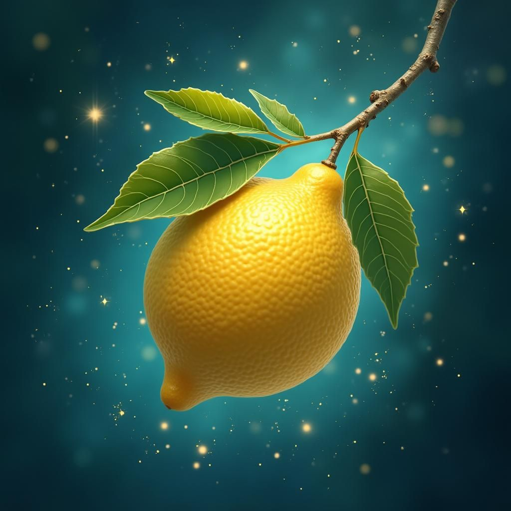
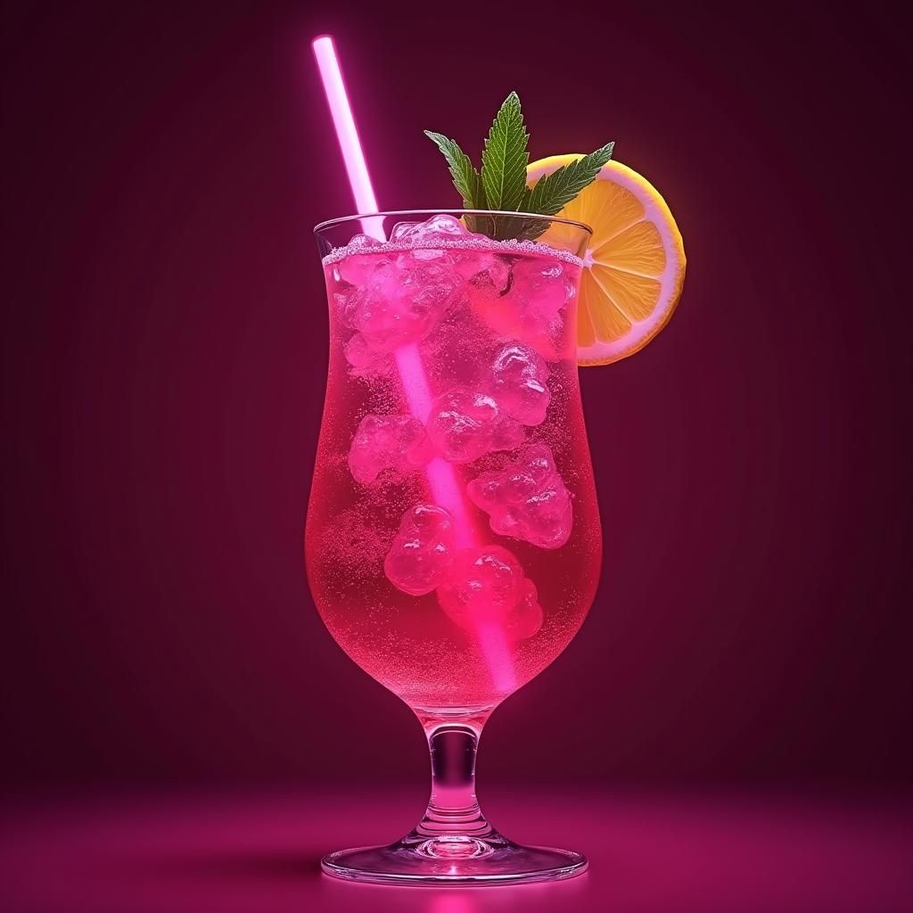

Two early Kasplex L2 EVM Memecoins:  
# $LEMON & $SODA  
## You need $Lemon to get $Soda.  

  
  
  

## Contract addresses (don't fall for scams!): 
$Lemon:  
$Soda: 

## Buy $Lemon on Dexes:  
###  [kspr.exchange](https://app.kspr.exchange/?ref=Mambo)
### Kaspa.com dex planned, as soon as we have enouhg funds generated.  
other Dex'es planned, depending on demand and funds available.  

## Stake $Lemon here to get tasty $Soda rewards:  
Staking of $Lemon for $Soda rewards on Kaspa.com dex as soon as available.  
Saking of $Lemon on ksrp for $Soda if available.  

## How to buy or get $Soda:
We create a $Lemon / $Soda pool on [kspr.exchange](https://app.kspr.exchange/?ref=Mambo)  
You can buy $Soda with $Lemon.  
Stake $Lemon on kaspa.com dex and get tasty $Soda rewards.  
Once a Dex offers limit orders of Clob (central limit order book)   
we will open a Kas/$Soda pool and place small sell orders to generate more sustainable funds for the $Lemon and $Soda treasury.  

# Tokenomics:  
## $Lemon:  
Total supply: 10 million tokens.  
Put in initial smal Kas/Lemon pool: 3 Million tokens.  
Put in pool with $Soda at 10:1: 3 Million tokens.  
2 Million tokens for soft sales in a price curve to generate funds  
for better liquidity, other pools on other dexes and for buying $Soda rewards.  
The concept is sustainable. the $Soda rewards must be bought, they are not free inflating tokens.  
2 Million tokens as reserves for other pools liquidity.  
0, 0%, ZERO, nada, null, nichts, no preallocation whatsovever.  
If it sounds to good to be true: Our business model are the small pool fees and the success.  

## $Soda
Total supply: 1 Million $Soda token.  
Put in a pool with $Lemon: 300'000 $Soda.  
300k tokens reserve for future Kas pool.  
200k tokens for soft sales to generate liquidity for a Kas/pool.  
200k tokens reserve for other pools or other Dexes.  
The $Soda rewards must be bought from the $Lemon liquidity. They are not free!  
0, 0%, ZERO, nada, null, nichts, no preallocation whatsovever.  
If it sounds to good to be true: Our business model are the small pool fees and the success.  
Not used tokens maybe burnt later on.  

## Transparency:  
$Lemon & $Soda reserves accounts:  
Will be soon updated.  

### That's it.
This is the whitepaper for $Lemon and $Soda L2 Kasplex EVM Memecoins.  
------- 
You need $Lemon to get a $Soda!
-------  
|  |  |
|------------------------|------------------------|
